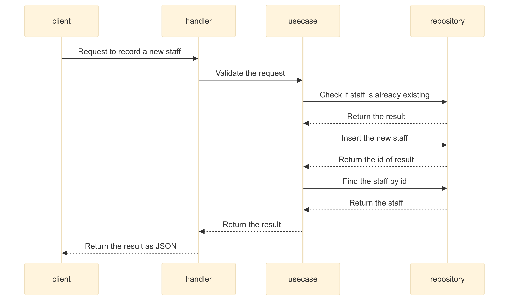

# Rust Clean Architecture V1
`Author:` Ruangyot Nanchiang (Lookhin)

## Introduction
This is a simple example of a Rust project using the Clean Architecture principles.

The project is a simple REST API that allows you to record a new item into the database but need to validate the item fisrt in-case of the item is already exist in the database.

**here is the flow of the project:**



## Tech Stack
- `Rust`
- `Axum`
- `SQLx`
- `PostgreSQL`

## Project Structure
```text
📂rust-clean-architecture-v1/
|   📄.gitignore
|   📄Cargo.lock
|   📄Cargo.toml
|   📄README.md
|   📄Setting.toml
|   
+---📂src/
   |    📄lib.rs
   |    📄main.rs
   |    📄setting.rs
   |    📄database.rs
   |    📄time_helper.rs
   |
   +---📂entities/
   |    📄items.rs
   |    📄mod.rs
   |    
   +---📂handlers/
   |    📄staff.rs
   |    📄mod.rs
   |    
   +---📂models/
   |    📄item.rs
   |    📄error.rs
   |    📄mod.rs
   |    
   +---📂repositories/
   |    📄items.rs
   |    📄staff.rs
   |    📄mod.rs
   | 
   +---📂usecases/
        📄staff_test.rs
        📄staff.rs
        📄mod.rs
```

## Start the PostgreSQL database
1. Start the PostgreSQL database
```bash
docker pull postgres:alpine
```

2. Create a new PostgreSQL container
```bash
docker run --name mygamedb -p 5432:5432 -e POSTGRES_PASSWORD=123456 -d postgres:alpine
```

3. Create a new database
```bash
docker exec -it mygamedb bash
```
```bash
psql -U postgres
```
```bash
CREATE DATABASE mygamedb;
```

4. Create a new table
```bash
\c mygamedb;
```
```sql
begin;

create table items (
    "id" serial primary key,
    "name" varchar(64) not null,
    "category" varchar(64) not null,
    "created_at" timestamp not null,
    "updated_at" timestamp not null
);

commit;
```

## Start the project
1. Clone the project
```bash
git clone https://github.com/Rayato159/rust-clean-architecture-v1.git
```

2. Install the dependencies
```bash
cargo build
```

3. Run the project
```bash
cargo run
```

4. Test the project
```bash
cargo test
```